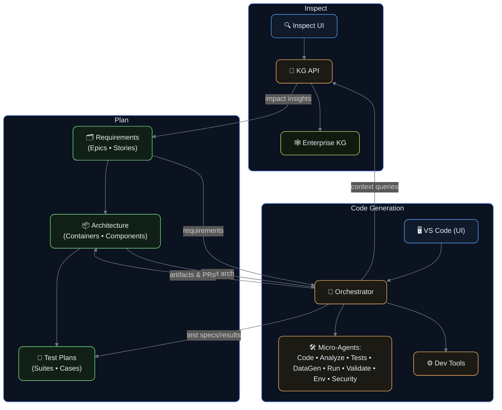

---
# Global deck settings
theme: default
title: Kavia – Code Generation Platform for Teams
info: |
  Kavia Investor Deck — 20 slides
  Dark theme aligned to new Kavia ember/orange palette with elevated panels.
class: "text-left kavia-canvas"
mdc: true
transition: slide-left
fonts:
  sans: Inter, "Helvetica Neue", Arial, sans-serif
  mono: ui-monospace, SFMono-Regular, Menlo, Monaco, Consolas, "Liberation Mono", "Courier New", monospace
css: |
  @import "./style.css";

---
# KAVIA AI 

  

    
    <h2 class="text-hero">Transforming Enterprise Software Development to AI-Native</h2>
    
An agentic workflow platform and knowledge graph that modernizes and accelerates the entire SDLC

    
Founders: Labeeb Ismail, Anita Ganti, Rich Saffir • Date: 2025-08-31 • Contact: labeeb@kavia.ai

    

      <button class="btn-primary">Explore Deck</button>
      <button class="btn-secondary">Contact</button>
    

  

---

# The Problem

  

    
Bottlenecks

    <h3 class="problem-title">Enterprise SDLC is slow and costly</h3>
    <ul class="problem-points">
      <li>Large codebases and complex dependencies</li>
      <li>Tribal knowledge and undocumented processes</li>
      <li>Slow iteration cycles and high engineering costs</li>
    </ul>
  

  

    
Urgency

    <h3 class="problem-title">Pressure to modernize keeps rising</h3>
    <ul class="problem-points">
      <li>Constant upgrades and refactoring in a fast-moving stack</li>
      <li>Low barriers enable disruptors to ramp quickly</li>
    </ul>
  

  

    
AI Gap

    <h3 class="problem-title">Generative AI adoption stalls in practice</h3>
    <ul class="problem-points">
      <li>Single-step tools lack complete view of context</li>
      <li>Hard to integrate with real-world repos and CI/CD</li>
      <li>Enterprise assets not AI-native; context is fragmented</li>
      <li>Limited collaboration and governance</li>
    </ul>
  

---

# Our Solution

<section class="solution">
  <header class="solution__header">
    <h2>Our Solution</h2>
    

      Kavia: a multi-agent orchestration platform for E2E Software Development with a Custom Knowledge Graph.
    

  </header>

  

    <article class="kpi-card">
      
3–5x

      
FASTER DELIVERY

    </article>
    <article class="kpi-card">
      
1/3

      
RESOURCES

    </article>
    <article class="kpi-card">
      
100s

      
ENGINEERS SUPPORTED

    </article>
  

  

    

      AGENTS
      <h3 class="feature-title">Specialized micro-agents</h3>
      
Planning, coding, testing, docs, bug fixing, code-scanning, deployment, etc.

    

    

      WORKFLOW
      <h3 class="feature-title">Enterprise-integrated</h3>
      
CI-aware, repository-native, aligned to enterprise processes/tools

    

    

      KNOWLEDGE GRAPH
      <h3 class="feature-title">Unified enterprise context</h3>
      
Custom Knowledge Graph powering all agents for deep understanding

    

  

</section>

---

# Product Overview

  

    

      <h3 class="feature-title">Inspect</h3>
      
Analyze codebase, requirements, and enterprise assets

    

    

      <h3 class="feature-title">Plan</h3>
      
Create Requirements, Design, Architecture, and Test Plans

    

    

      <h3 class="feature-title">Build</h3>
      
Write, refactor, migrate, test, and integrate based on the plan

    

  

  

    

      
Product

      
Product screenshot / UI mock placeholder

    

  

---

# KAVIA Differentiators

  

    <h3 class="feature-title">Kavia Knowledge Graph</h3>
    
LLM-friendly, unified enterprise context

  

  

    <h3 class="feature-title">Lifecycle Orchestration</h3>
    
End-to-end workflows across the SDLC

  

  

    <h3 class="feature-title">Customizable</h3>
    
Adaptable workflows for team-specific needs

  

  

    <h3 class="feature-title">Enterprise Integrations</h3>
    
Connectors for tools and platforms used at scale

  

---

# How It Works (Architecture)

---

# Market Opportunity

  

    

      
TAM

      <h3 class="feature-title">Software Dev Tools/Platforms</h3>
      
$60B+ globally (est.)

    

    

      
SAM

      <h3 class="feature-title">AI-assisted Dev & DevEx</h3>
      
Rapidly expanding with AI adoption

    

    

      
Industries

      <ul class="points-clean">
        <li>HealthTech, Automotive, SaaS, FinTech, </li>
        <li>Platform, Product Engineering</li>
      </ul>
    

  

  

    

      
Market

      
Market size chart placeholder

    

  

---

# Competitive Landscape

  
Matrix

  
Competitive matrix placeholder

---

# Ideal Customer Profile (ICP)

  

    
Org

    

      ORGANIZATIONS
      <h3 class="feature-title">Mid-market & Enterprise</h3>
      
50–1000+ engineers

    

  

  

    
Team

    

      TEAM TRAITS
      <ul class="points-clean">
        <li>Multiple services, complex CI/CD, strong governance</li>
        <li>Refactoring, migration, maintenance backlogs</li>
        <li>High cost and delivery time pressure</li>
      </ul>
    

  

  

    
Ind

    

      INDUSTRIES
      <ul class="points-clean">
        <li>SaaS, FinTech, HealthTech</li>
        <li>E-commerce, Platform</li>
        <li>Product Engineering teams</li>
      </ul>
    

  

---

# Use Cases

  
<h3 class="feature-title">New Feature Development</h3>
On large codebases with tests and docs

  
<h3 class="feature-title">Refactoring at Scale</h3>
Safely modernize legacy modules

  
<h3 class="feature-title">API-first Development</h3>
Auto-generate OpenAPI and clients

  
<h3 class="feature-title">Test Coverage</h3>
Expand tests and remediate flaky cases

  
<h3 class="feature-title">Security Hardening</h3>
Secret scans, upgrades, policy checks

  
<h3 class="feature-title">Migrations</h3>
New frameworks and languages

  
<h3 class="feature-title">Legacy Maintenance</h3>
Ongoing upkeep and refactoring

  
<h3 class="feature-title">Documentation</h3>
Architecture, API, runbooks

  
<h3 class="feature-title">Engineer Onboarding</h3>
Quick-start for new engineersx

---

# Business Model

  

    

      PRICING
      <ul class="points-clean">
        <li>Subscription tiers by seats and usage</li>
        <li>Enterprise plan with SSO, VPC/on‑prem, SLAs</li>
      </ul>
    

    

      
Pricing

      
Pricing table placeholder

    

  

  

    

      EXPANSION
      <ul class="points-clean">
        <li>Add‑on modules: compliance packs, SOC2 helpers, custom agents</li>
        <li>Marketplace for community/partner templates</li>
      </ul>
    

  

---

# Go-To-Market Strategy

  

    

    

      
Bottom-up

      <ul class="points-clean">
        <li>Free trials, self‑serve onboarding</li>
        <li>Individuals & small teams</li>
      </ul>
    

  

  

    

    

      
Top-down

      <ul class="points-clean">
        <li>Enterprise features, security reviews, on-prem options</li>
        <li>Mid‑market & enterprise orgs</li>
        <li>Onboarding, FDE, Customer success playbook</li>
      </ul>
    

  

  

    

    

      
Channels

      <ul class="points-clean">
        <li>Developer advocacy, content, workshops, universities</li>
        <li>Partnerships: ISVs, SIs, Cloud Providers</li>
      </ul>
    

  

---

# Traction and Metrics

  

    
1000+

    
USERS

  

  

    
200

    
ENGINEERS (TATA)

  

  

    
15

    
ENTERPRISE TRIALS

  

  
KPIs

  
KPI chart placeholder

---

# Roadmap

  

    

    

      
0–6 months

      <ul class="points-clean">
        <li>Deeper CI integrations; broader language/framework coverage</li>
        <li>Unified Chat across agents</li>
        <li>VS Code extension</li>
        <li>Connectors for 50+ enterprise tools</li>
      </ul>
    

  

  

    

    

      
6–12 months

      <ul class="points-clean">
        <li>Agent marketplace & partner templates</li>
        <li>Expanded compliance packs & governance</li>
      </ul>
    

  

  

    

    

      
12+ months

      <ul class="points-clean">
        <li>Predictive delivery insights</li>
        <li>Autonomous refactoring missions with approval gates</li>
      </ul>
    

  

---

# Case Study

  

    CUSTOMER
    <h3 class="feature-title">[Anonymized Mid‑Market SaaS]</h3>
    <ul class="points-clean">
      <li>Legacy codebase + 3 new services</li>
      <li>Estimated 5–9 FTE months</li>
    </ul>
  

  

    RESULTS
    <h3 class="feature-title">2 weeks to completion</h3>
    
From ingestion to PRs and documentation

  

  KAVIA APPROACH
  <ul class="points-clean">
    <li>Automatic ingestion of codebase</li>
    <li>Deep analysis of requirements</li>
    <li>End‑to‑end code, tests, and docs generation</li>
  </ul>

---

# Team

  

    
LI

    

      <h4 class="feature-title">Labeeb Ismail</h4>
      
Product/Engineering leadership, AI, Enterprise SW Dev

    

  

  

    
AG

    

      <h4 class="feature-title">Anita Ganti</h4>
      
GTM/Executive leadership, Enterprise sales

    

  

  

    
RS

    

      <h4 class="feature-title">Rich Saffir</h4>
      
Ex‑Wurl, ex‑Tower Cloud

    

  

  

    
JC

    

      <h4 class="feature-title">Joe Chow</h4>
      
Ex‑Cisco, Ex‑Comscope

    

  

  

    
JS

    

      <h4 class="feature-title">Joe Stockwell</h4>
      
Ex‑Exodus

    

  

  

    
SS

    

      <h4 class="feature-title">Sri Solar</h4>
      
CEO, Kenmore Appliances

    

  

  

    
AJ

    

      <h4 class="feature-title">Aljit Joy</h4>
      
Ex‑Comcast

    

  

---

# Financials & Use of Funds

  

    

      
Current

      <ul class="points-clean">
        <li>Bootstrapped/pre‑seed: 1M</li>
        <li>B2C launch and initial customer acquisitions</li>
        <li>$2.5M SAFE raised/committed</li>
        <li>~9 months runway</li>
      </ul>
    

  

  

    

      
Use of Funds

      
Use of funds pie chart placeholder

    

  

---

# Ask & Contact

  

    
Fundraising

    <h2 class="text-hero">Seeking additional $2.5M SAFE</h2>
    
Targets: 60–100 customers; $2.7M ARR by Q1 2026

    

      <button class="btn-primary">Intro Us</button>
      <a href="mailto:labeeb@kavia.ai" class="btn-secondary">Email: labeeb@kavia.ai</a>
    

  

  

    

      HOW YOU CAN HELP
      <ul class="points-clean">
        <li>Intros to design partners & enterprise customers</li>
        <li>Advisorship in governance/compliance & partnerships</li>
      </ul>
      
www.kavia.ai

    

  

Press S for presenter mode • Press E to open editor • Use toolbar for PDF export

